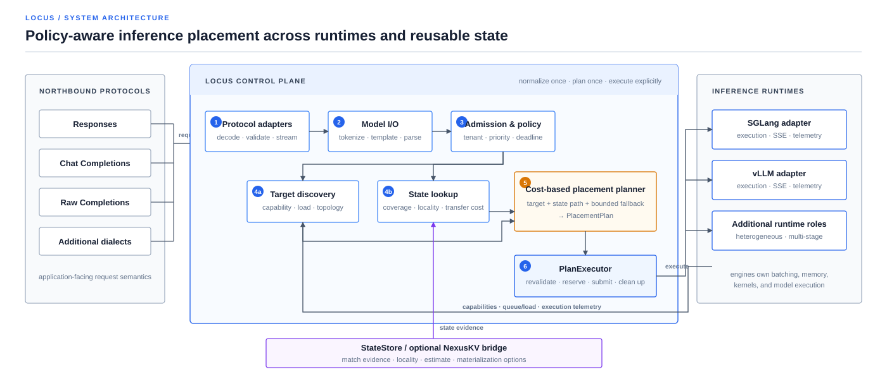

<h1 align="center">Locus</h1>

<p align="center">
  <strong>A policy-aware control plane for inference placement across engines.</strong>
</p>

<p align="center">
  Normalize each request once. Apply fleet policy once.<br/>
  Choose compute and reusable state together.
</p>

<p align="center">
  <a href="README_CN.md">简体中文</a>
</p>

<p align="center">
  <a href="https://github.com/imReese/Locus/actions/workflows/ci.yml"></a>
  <a href="LICENSE"></a>
  
  
</p>

Locus sits between application APIs and inference engines. It normalizes the
request once, applies tenant and traffic policy, discovers what each target can
actually execute, evaluates reusable-state paths, and produces one explainable
placement plan.

Execution engines still own batching, accelerator memory, kernels, and model
execution. Optional state systems such as NexusKV provide reuse evidence and
materialization options; they do not choose the final execution target.

## Start in two minutes

Run a complete HTTP path backed by deterministic fake engines—no GPU, model
download, hosted API key, or external provider required:

```bash
git clone https://github.com/imReese/Locus.git
cd Locus
cargo run -p locus-server --example sdk_fixture
```

In another terminal, send an OpenAI Responses request:

```bash
curl http://127.0.0.1:18080/v1/responses \
  -H 'Authorization: Bearer locus-test-key' \
  -H 'Content-Type: application/json' \
  -d '{"model":"locus-test","input":"respond with JSON"}'
```

Or exercise Responses, Chat Completions, raw Completions, JSON/SSE, structured
output, errors, authentication, and cancellation through the pinned official
Python SDK:

```bash
python -m pip install -r scripts/openai-sdk-e2e-requirements.txt
python scripts/openai_sdk_e2e.py --fixture-counts
```

This quickstart proves the local protocol and orchestration path. It does not
claim that a live model ran.

## Follow one request

<p align="center">
  
</p>

The planner can reason about facts that disappear at a generic HTTP routing
layer:

- the exact tokenizer, template, parser, and model revision behind an alias;
- whether a target supports the requested output and execution semantics;
- tenant limits, priority, deadlines, cancellation, and drain state;
- queue, prefill, decode, topology, and policy costs; and
- compatible reusable state, its executable coverage, locality, and
  materialization cost.

Planning remains separate from side effects. The planner returns a
`PlacementPlan`; `PlanExecutor` revalidates it, reserves the target, coordinates
optional state import, submits work, applies bounded fallback, and cleans up.

## Know where Locus fits

These components solve different layers of the serving problem:

| Component | Decides | Deliberately leaves elsewhere |
| --- | --- | --- |
| Generic L7 proxy | Which upstream receives an HTTP request | Model semantics, runtime capabilities, reusable state, engine-local execution |
| Inference engine scheduler | How work is batched and executed inside one runtime | Fleet-wide tenant policy and cross-runtime placement |
| State/cache system | What reusable state exists and how it may be materialized | Final request placement and runtime-local consumption |
| **Locus** | Which eligible target and state path should serve a normalized request | Batching, device allocation, kernels, and physical data-plane ownership |

Locus is useful when routing depends on inference facts, not only endpoint
health or request counts. It is not intended to replace the other three layers.

## What ships today

> [!IMPORTANT]
> Locus is pre-1.0. The repository contains a deployable control-plane slice
> with deterministic CI and real local SDK transport. Live GPU execution,
> native engine state import, and physical state transfer require separate
> deployment qualification and are not implied by a green CI badge.

| Surface | Available now | Qualification boundary |
| --- | --- | --- |
| Northbound API | OpenAI-compatible Responses, Chat Completions, raw text/token Completions, model listing, JSON/SSE, and OpenAI-shaped errors | Tested in process and with the official SDK over local HTTP; an API subset, not full parameter parity |
| Model semantics | Versioned profiles, Hugging Face `tokenizer.json`, bounded MiniJinja templates, reasoning/tool parsers, structured output, and content-derived identities | Deterministic profiles and fixtures; additional model dialects must be added explicitly |
| Traffic control | Credential-bound tenants, weighted admission, request/token limits, deadlines, cancellation, overload shedding, and bounded drain | Deterministic and local HTTP coverage; real workload fairness remains deployment evidence |
| Placement | Capability filtering, state lookup and costing, explainable plans, bounded replanning, shadow evaluation, and gated calibration promotion | Planner and mock-telemetry evidence; live accuracy is not established by CI |
| Engine edge | SGLang and vLLM completion, SSE, and telemetry adapters | Mock HTTP/SSE/Prometheus conformance; live runtime qualification is opt-in |
| State edge | Generic `StateStore` plus a versioned NexusKV bridge | Cross-process protocol CI; physical transfer and native engine import remain unverified |
| Operations | Health/readiness, Prometheus metrics, request IDs, structured tracing, persistent bounded calibration, and graceful shutdown | Deterministic server and failure-path coverage |

## System boundaries

| Owner | Responsibility |
| --- | --- |
| **Locus** | Protocol and model semantics, admission and policy, target/state-path planning, plan execution, and cross-target observability |
| **Execution engines** | Continuous batching, engine-local scheduling, accelerator memory, kernels, parallelism, and model execution |
| **State stores** | Reusable-state lookup, compatibility evidence, locality, transfer options, physical operations, and store-managed lifecycle |

Core contracts do not require a specific northbound API, inference engine,
state store, or transport. Runtime-specific types stay at the edges.

The design is built around five invariants:

1. **Stable internal model:** runtime-specific APIs stop at the adapter
   boundary.
2. **Semantic consistency:** compatible targets receive the same normalized
   request and produce the same application-facing meaning.
3. **Capability negotiation:** adapters reject or explicitly degrade unsupported
   requirements; they do not guess.
4. **Compute and state are planned together:** a prefix match alone is not a
   placement decision.
5. **Fail-closed promotion:** missing compatibility or calibration evidence
   cannot silently become an active-placement claim.

## Run a configured server

[`examples/locus-server.json`](examples/locus-server.json) demonstrates model
profiles, tenant policy, runtime discovery, bounded telemetry, shadow placement,
and graceful drain. Replace every placeholder artifact revision, path,
credential, and endpoint with deployment facts:

```bash
LOCUS_PREMIUM_API_KEY=replace-me \
LOCUS_BATCH_API_KEY=replace-me \
cargo run -p locus-server -- examples/locus-server.json
```

The server exposes `/healthz`, `/readyz`, `/metrics`, `/v1/models`,
`/v1/responses`, `/v1/chat/completions`, and `/v1/completions`. New deployments
should begin with placement calibration in `shadow` mode. Promotion to `active`
requires persistent qualified evidence and exact operator confirmation.

## What each check proves

Locus reports what each test actually observes instead of promoting every green
check to “production ready”:

| Evidence level | In GitHub CI | Establishes |
| --- | --- | --- |
| Static and deterministic | Yes | Contracts, ownership, ordering, limits, failure policy, and mock HTTP/SSE behavior |
| Official SDK over local HTTP | Yes | Client parsing and transport compatibility through a real socket |
| Cross-process state protocol | Yes | Versioned lookup/estimate/materialize compatibility and prepare/commit orchestration |
| Live runtime | Opt-in | Observed execution and telemetry movement for one configured runtime and model |
| Live multi-runtime traffic | Opt-in | Measured work on distinct runtimes plus policy, latency, cancellation, overload, and metrics gates |
| Live state and hardware | Deployment-specific | Native import, physical transfer, topology, and production performance |

See [Validation and evidence levels](docs/validation/serving.md) for the exact
harnesses and acceptance gates.

## Read next

| Goal | Document |
| --- | --- |
| Understand the ownership model | [Architecture](docs/design/architecture.md) |
| Implement an engine integration | [Canonical engine protocol](docs/design/canonical-engine-protocol.md) · [Engine adapter contract](docs/design/engine-adapter-contract.md) |
| Add model semantics or an API dialect | [Model I/O](docs/design/model-io.md) · [OpenAI-compatible API](docs/design/openai-api.md) |
| Follow compute and reusable-state planning | [State-aware scheduling](docs/design/state-aware-scheduling.md) · [NexusKV bridge](docs/design/nexuskv-bridge.md) |
| Configure and operate the server | [Serving and configuration](docs/operations/serving.md) |

The workspace follows the request path: foundation crates (`core`, `model-io`,
`parser`), engine/store ports, planner/runtime control plane, edge adapters, and
the `locus-server` application. See [the crate map](crates/README.md) for package
names and responsibilities.

## Development

Run the same repository gate used by GitHub CI:

```bash
bash scripts/ci.sh
```

It checks formatting, strict workspace Clippy, all-feature tests, rustdoc with
warnings denied, Python syntax, and the traffic-harness unit tests. Rust and
public wire formats remain pre-1.0.

## Scope

Locus is not a model execution runtime, an engine-local scheduler, or a generic
reverse proxy. It does not guarantee that every target can emulate every API
feature, and it does not turn protocol conformance into proof of live GPU,
state-transfer, soak, or fault-tolerance behavior.

## License

Locus is licensed under the [Apache License 2.0](LICENSE).
