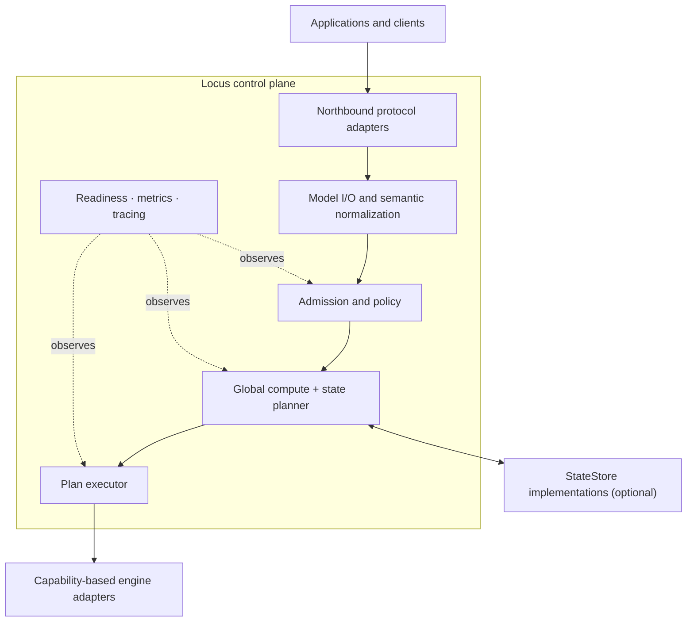

<h1 align="center">Locus</h1>

<p align="center">
  <strong>Locus is an engine-neutral inference control plane for compute and model-state placement.</strong>
</p>

<p align="center">
  <a href="https://github.com/imReese/Locus/actions/workflows/ci.yml"></a>
  <a href="LICENSE"></a>
  
  
</p>

<p align="center">
  <a href="#why-locus">Why Locus</a> ·
  <a href="#architecture">Architecture</a> ·
  <a href="#try-it-locally">Try it</a> ·
  <a href="#current-integrations">Integrations</a> ·
  <a href="#documentation">Docs</a> ·
  <a href="#validation">Validation</a>
</p>

Inference is a placement problem involving both compute and state. Locus
separates application protocols and model I/O from runtime-specific execution,
then evaluates execution capabilities, traffic policy, and reusable-state paths
as one global decision.

> **Locus decides where inference should happen and where its reusable state
> should live.** Execution engines remain responsible for running the model
> efficiently.

> [!NOTE]
> Locus is pre-1.0. The repository contains a deployable control-plane slice;
> CI establishes deterministic contracts, real local SDK transport, and a
> cross-process state protocol. Live runtime, hardware, and physical state
> transfer qualification remain deployment-specific.

## Why Locus?

Applications should not have to adopt different templates, parsers, request
semantics, traffic policies, and state-reuse logic for every inference runtime.
Engines should focus on batching, memory management, kernels, parallelism, and
model execution—not repeatedly reimplement application-facing semantics or
global fleet policy.

Locus provides a common control plane for:

- protocol adaptation and model-semantic normalization;
- admission, tenant policy, deadlines, cancellation, and overload behavior;
- capability discovery across heterogeneous execution targets;
- cost-based placement across compute and reusable model state; and
- plan execution, readiness, metrics, tracing, and stable failure semantics.

State is not reduced to the longest matching token prefix. A reusable artifact
may be a paged KV cache, latent or recurrent checkpoint, prepared multimodal
input, encoder output, or a future typed state kind. Compatibility, executable
coverage, locality, and materialization cost are explicit planner inputs.

## Architecture



| Boundary | Ownership |
| --- | --- |
| Locus | Protocol and model semantics, admission and policy, target/state-path planning, plan execution, and cross-target observability |
| Execution engines | Continuous batching, engine-local scheduling, accelerator memory, kernels, parallelism, and model execution |
| State stores | Reusable-state lookup, compatibility evidence, locality, materialization options, transfer operations, and store-managed lifecycle |

The engine and store planes depend on Locus contracts at the edges. No core
type requires a particular inference runtime, state store, or transport stack.

## Design invariants

- **Engine neutrality:** runtime-specific types stay outside core contracts.
- **Semantic consistency:** compatible targets receive the same normalized
  request and produce the same application-facing meaning.
- **Capability negotiation:** unsupported requirements are rejected or follow
  an explicit policy-approved degradation; adapters do not guess.
- **State-aware placement:** compute cost and reusable-state paths are evaluated
  together before choosing a target.
- **Clear side-effect boundary:** the planner selects a `PlacementPlan`;
  `PlanExecutor` performs reservation, materialization, submission, fallback,
  cancellation, and cleanup.
- **Fail-closed evidence:** unknown compatibility or unqualified promotion does
  not become an optimistic placement claim.

## What Locus provides

| Area | Capability |
| --- | --- |
| Model semantics | Versioned profiles, templates, tokenization and detokenization, reasoning/tool parsing, structured output, and content-derived identities |
| Traffic policy | Credential-bound tenants, weighted admission, request/token limits, deadlines, cancellation, overload shedding, and bounded drain |
| Placement | Capability filtering, state lookup and costing, explainable plans, bounded replanning, shadow evaluation, and gated calibration promotion |
| Execution boundary | Dynamic target discovery, canonical requests and events, execution leases, cancellation, and optional prepared-state attachment |
| Operations | Health/readiness probes, low-cardinality Prometheus metrics, request IDs, structured tracing, persistent bounded calibration, and graceful shutdown |

## Try it locally

The bundled fixture exercises the HTTP and SDK path with deterministic fake
engines. It needs no model download, GPU, hosted API key, or external provider.
Rust 1.85 or newer is required.

```bash
git clone https://github.com/imReese/Locus.git
cd Locus
cargo run -p locus-server --example sdk_fixture
```

In another terminal:

```bash
curl http://127.0.0.1:18080/v1/responses \
  -H 'Authorization: Bearer locus-test-key' \
  -H 'Content-Type: application/json' \
  -d '{"model":"locus-test","input":"respond with JSON"}'
```

The same fixture works through the pinned official SDK:

```bash
python -m pip install -r scripts/openai-sdk-e2e-requirements.txt
python scripts/openai_sdk_e2e.py --fixture-counts
```

This proves local protocol and transport behavior, not live runtime or hardware
execution. See [Validation](#validation) for the evidence levels.

## Current integrations

Specific integrations are replaceable edge implementations, not the definition
of Locus:

| Boundary | Current implementation | Evidence boundary |
| --- | --- | --- |
| Northbound | OpenAI-compatible Responses, Chat Completions, raw text/token Completions, model listing, JSON/SSE, and OpenAI-shaped errors | In-process conformance and official SDK over local HTTP; this is an API subset, not full parameter parity |
| Model I/O | Hugging Face `tokenizer.json`, bounded MiniJinja templates, tagged reasoning/tool parsers, and structured output | Deterministic profile, parser, and SDK fixtures; additional model dialects remain explicit follow-on work |
| Engine adapters | SGLang and vLLM completion/telemetry adapters | Deterministic mock HTTP/SSE/Prometheus conformance; live runtime qualification is opt-in |
| State store | Optional versioned NexusKV bridge behind the generic `StateStore` contract | Cross-process protocol CI; native engine import and physical state transfer remain unverified |

## Configured deployment

[`examples/locus-server.json`](examples/locus-server.json) demonstrates model
profiles, tenant policy, runtime discovery, bounded telemetry, shadow placement,
and graceful drain. Its artifact revisions, paths, credentials, and endpoints
are placeholders and must be replaced with deployment facts.

```bash
LOCUS_PREMIUM_API_KEY=replace-me \
LOCUS_BATCH_API_KEY=replace-me \
cargo run -p locus-server -- examples/locus-server.json
```

The server exposes `/healthz`, `/readyz`, `/metrics`, `/v1/models`,
`/v1/responses`, `/v1/chat/completions`, and `/v1/completions`. New deployments
should begin with calibrated placement in `shadow` mode; promotion to `active`
fails closed without persistent qualified evidence and exact operator
confirmation. See [Serving and configuration](docs/operations/serving.md).

## Documentation

| If you want to… | Read |
| --- | --- |
| Understand the system boundary and ownership model | [Architecture](docs/design/architecture.md) |
| Implement or evaluate an engine integration | [Canonical engine protocol](docs/design/canonical-engine-protocol.md) · [Engine adapter contract](docs/design/engine-adapter-contract.md) |
| Understand tokenization, templates, parsers, and API semantics | [Model I/O](docs/design/model-io.md) · [OpenAI-compatible API](docs/design/openai-api.md) |
| Follow request and reusable-state placement | [State-aware scheduling](docs/design/state-aware-scheduling.md) · [NexusKV bridge](docs/design/nexuskv-bridge.md) |
| Configure and operate `locus-server` | [Serving and configuration](docs/operations/serving.md) |
| Decide what a test result actually proves | [Validation and evidence levels](docs/validation/serving.md) |

## Repository map

| Layer | Crates | Responsibility |
| --- | --- | --- |
| Foundation | `locus-core`, `locus-model-io`, `locus-parser` | Canonical facts and identities, model normalization, and bounded output parsing |
| Ports | `locus-engine`, `locus-store` | Engine execution and generic reusable-state contracts |
| Control plane | `locus-planner`, `locus-runtime` | Placement, plan execution, inference orchestration, traffic policy, and observation |
| Edge adapters | `locus-openai`, `locus-engine-openai`, `locus-store-nexuskv` | Northbound protocol, engine, telemetry, and state-store integrations |
| Application | `locus-server` | Configuration, dependency assembly, authentication, probes, tracing, and shutdown |

## Development

Run the same repository gate used by GitHub CI:

```bash
bash scripts/ci.sh
```

It runs formatting, strict workspace Clippy, all-feature tests, rustdoc with
warnings denied, Python syntax checks, and traffic-harness unit tests. GitHub
Actions additionally runs the official SDK fixture and cross-process state
protocol job. Rust is the primary implementation language; public wire formats
and Rust APIs remain pre-1.0.

## Validation

Locus keeps deterministic, protocol, live-runtime, and physical-hardware
evidence separate:

| Evidence level | GitHub CI | What it establishes |
| --- | --- | --- |
| Static and deterministic | Yes | Local contracts, ownership, ordering, limits, and mock HTTP/SSE behavior |
| Official SDK over local HTTP | Yes | Client parsing and transport compatibility through a real socket |
| Cross-process state protocol | Yes | Versioned lookup/estimate/materialize compatibility and prepare/commit orchestration |
| Live runtime | Opt-in | Observed behavior and telemetry movement for a configured runtime and model |
| Live multi-runtime traffic | Opt-in | Measured execution across distinct runtimes plus policy, latency, cancellation, overload, and metrics gates |
| Live state and hardware | Deployment-specific | Native import, physical transfer, topology, and production performance |

GitHub CI runs the first three levels. It does not establish live accelerator
execution, native engine state import, physical state transfer, production
fairness/telemetry, soak behavior, or fault tolerance. The opt-in harnesses and
exact acceptance gates are documented in
[Validation and evidence levels](docs/validation/serving.md).

## Scope

Locus is not:

- another model execution runtime;
- a replacement for engine-local schedulers;
- tied to one northbound API, inference engine, state system, or HTTP stack;
- a guarantee that every target can emulate every requested feature; or
- a generic reverse proxy that is unaware of inference semantics.

## License

Locus is licensed under the [Apache License 2.0](LICENSE).
