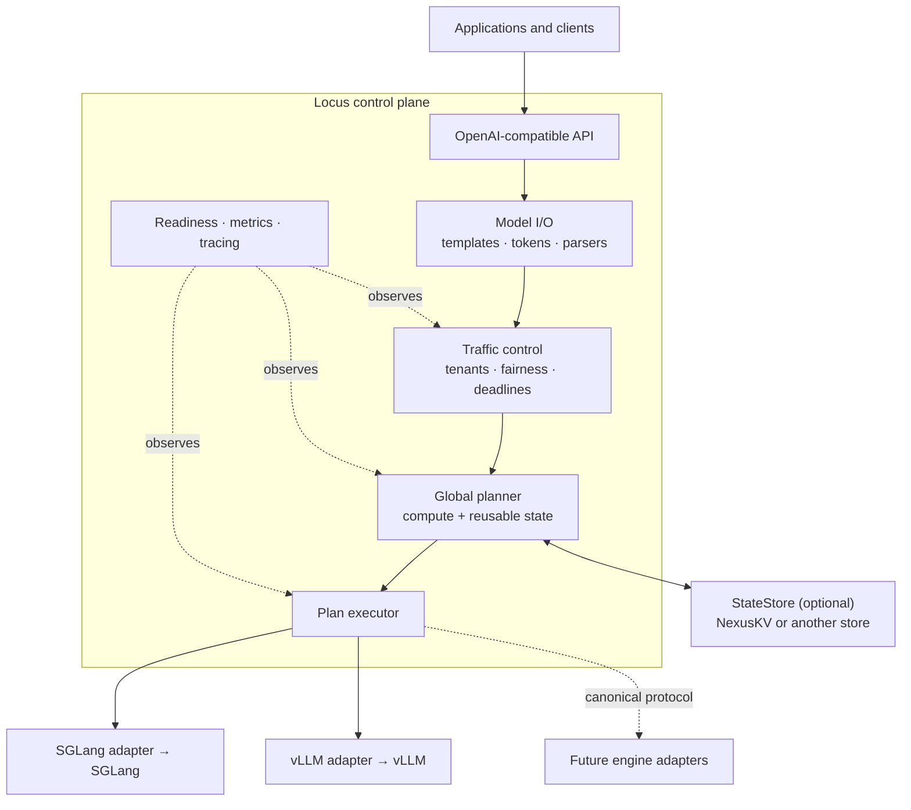

<h1 align="center">Locus</h1>

<p align="center">
  <strong>An engine-neutral inference control plane for compute and model-state placement.</strong>
</p>

<p align="center">
  <a href="https://github.com/imReese/Locus/actions/workflows/ci.yml"></a>
  <a href="LICENSE"></a>
  
  
</p>

<p align="center">
  <a href="#why-locus">Why Locus</a> ·
  <a href="#try-it-locally">Try it</a> ·
  <a href="#architecture">Architecture</a> ·
  <a href="#documentation">Docs</a> ·
  <a href="#validation-boundaries">Validation</a>
</p>

Locus sits above inference engines such as SGLang and vLLM. It gives
applications one model-semantic and OpenAI-compatible surface, then coordinates
traffic, execution capabilities, reusable-state locality, and global placement
across heterogeneous runtimes.

> **Locus decides where inference should happen and where its reusable state
> should live.** Engines remain responsible for running the model efficiently.

> [!IMPORTANT]
> Locus now contains a deployable end-to-end control-plane slice: a configured
> server process, content-addressed Hugging Face tokenizer/chat-template
> profiles, OpenAI Responses, Chat Completions, and raw-prompt Completions,
> SGLang/vLLM completion adapters, and an optional NexusKV bridge. CI validates
> the official OpenAI Python SDK against a real local HTTP server and runs Locus
> against a separate NexusKV bridge process. Live GPU serving and NexusKV
> physical transfer remain opt-in validations and are not claimed by CI.

## At a glance

| Area | What Locus provides today |
| --- | --- |
| Northbound API | OpenAI-compatible Responses, Chat Completions, raw text/token Completions, model listing, JSON/SSE, and OpenAI-shaped errors |
| Model semantics | Pinned Hugging Face tokenizers and templates, stable fingerprints, reasoning/tool parsers, structured output, and tokenize-once behavior |
| Engine plane | Dynamic model discovery and capability-aware adapters for SGLang and vLLM |
| Traffic control | Credential-bound tenants, weighted admission, request/token limits, deadlines, cancellation, overload shedding, and bounded drain |
| Placement | State-aware cost planning, shadow evaluation, persistent calibration, explicit promotion gates, and bounded replanning |
| State plane | Optional versioned NexusKV bridge behind a generic `StateStore`; state-free operation remains first-class |
| Operations | Health/readiness probes, low-cardinality Prometheus metrics, request IDs, structured tracing, and graceful shutdown |
| Evidence | Deterministic Rust tests, official OpenAI SDK E2E, and cross-process NexusKV protocol CI; live GPU qualification is opt-in |

## Try it locally

The bundled fixture runs the complete HTTP and SDK path with deterministic fake
engines. It needs no model download, GPU, hosted API key, or external provider.
Rust 1.85 or newer is required; Python is only needed for the SDK check.

```bash
git clone https://github.com/imReese/Locus.git
cd Locus
cargo run -p locus-server --example sdk_fixture
```

In another terminal:

```bash
curl http://127.0.0.1:18080/v1/responses \
  -H 'Authorization: Bearer locus-test-key' \
  -H 'Content-Type: application/json' \
  -d '{"model":"locus-test","input":"respond with JSON"}'
```

The same fixture is exercised by the pinned official OpenAI Python SDK:

```bash
python -m pip install -r scripts/openai-sdk-e2e-requirements.txt
python scripts/openai_sdk_e2e.py --fixture-counts
```

Or point the SDK at it directly:

```python
from openai import OpenAI

client = OpenAI(
    base_url="http://127.0.0.1:18080/v1",
    api_key="locus-test-key",
)
response = client.responses.create(
    model="locus-test",
    input="respond with JSON",
)
print(response.output_text)
```

The fixture proves local protocol behavior, not live SGLang/vLLM or GPU
execution. See [Validation boundaries](#validation-boundaries) for the evidence
levels.

## Why Locus?

Inference traffic is not ordinary HTTP load balancing. A safe placement choice
depends on model semantics, runtime capabilities, queue pressure, reusable-state
compatibility and locality, tenant policy, and the cost of moving or recomputing
state. Coupling those decisions to every application or engine makes behavior
drift as a fleet grows.

For intuition, Nginx sits in front of web servers; Locus coordinates workloads
in front of inference engines. It is inference-native, not merely another API
gateway or reverse proxy. The name *Locus* means a location or place: placement
is the central abstraction.

SGLang, vLLM, TensorRT-LLM, and future runtimes should be able to focus on
efficient execution. Applications should not have to adopt a different set of
templates, parsers, request semantics, and traffic policies for each engine.

Locus coordinates those concerns in a common control plane:

- OpenAI-compatible and future northbound protocols
- request validation and normalization
- chat templates, tokenization, and detokenization
- reasoning and tool-call semantics, with extensible multimodal contracts
- sampling and streaming normalization
- routing, load balancing, and admission control
- capability discovery and observability
- cost-based request and state placement

The core architectural contributions are:

1. a stable, engine-neutral semantic normalization layer;
2. a canonical engine protocol;
3. capability-based engine adapters;
4. a generic, optional state-store interface; and
5. cost-based global placement of requests and reusable state.

State locality is a first-class planner input, not an add-on routing policy.
The design covers KV caches, MLA state, recurrent/KDA checkpoints, multimodal
artifacts, and future model state rather than equating reuse with the longest
matching token prefix.

## Architecture



Locus owns global, cross-engine decisions. Execution engines continue to
own continuous batching, engine-local scheduling, GPU memory and KV-page
allocation, kernels, speculative decoding execution, CUDA graphs, distributed
parallelism, and model forward execution.

[NexusKV](https://github.com/imReese/NexusKV) is the intended reference
integration for reusable model state. It is not a dependency of Locus
core. A deployment may use another `StateStore` implementation or run with
store integration disabled.

## Design principles

- **Engine neutrality:** core request and response types do not expose SGLang,
  vLLM, TensorRT-LLM, or transport-framework types.
- **Capability negotiation:** adapters advertise what an engine can actually
  execute; unsupported features fail explicitly or follow an intentional
  fallback policy.
- **Semantic consistency:** templates, tokenization, parsing, and finish
  semantics remain stable when traffic moves between compatible engines.
- **Extensible inputs:** the canonical `InputBundle` represents token
  sequences, multimodal references, metadata, and future input forms.
- **State as a planning dimension:** reuse boundaries, compatibility,
  placement, and materialization cost participate in every eligible placement
  decision.
- **Clear ownership:** Locus performs global planning; engines retain
  control of their local execution loops.
- **No Python hot-path requirement:** Rust is the primary implementation
  language. Python remains an SDK and compatibility escape hatch.

## Documentation

| If you want to… | Read |
| --- | --- |
| Understand the system boundary and ownership model | [Architecture](docs/design/architecture.md) |
| Implement or evaluate an engine integration | [Canonical engine protocol](docs/design/canonical-engine-protocol.md) · [Engine adapter contract](docs/design/engine-adapter-contract.md) |
| Understand tokenization, templates, parsers, and API semantics | [Model I/O](docs/design/model-io.md) · [OpenAI-compatible API](docs/design/openai-api.md) |
| Follow request + reusable-state placement | [State-aware scheduling](docs/design/state-aware-scheduling.md) · [NexusKV bridge](docs/design/nexuskv-bridge.md) |
| Configure and operate `locus-server` | [Serving and configuration](docs/operations/serving.md) |
| Decide what a test result actually proves | [Validation and evidence levels](docs/validation/serving.md) |

## Repository map

The Rust 2024 workspace keeps dependency direction and side-effect boundaries
explicit:

| Layer | Crates | Responsibility |
| --- | --- | --- |
| Foundation | `locus-core`, `locus-model-io`, `locus-parser` | Canonical facts and identities; model normalization; pinned tokenizer/template profiles; bounded reasoning and tool-call parsing |
| Ports | `locus-engine`, `locus-store` | Engine execution leases and drain lifecycle; generic reusable-state contract; deterministic fakes |
| Control plane | `locus-planner`, `locus-runtime` | Cost-based plans and execution; target/state discovery; tenant admission; deadlines; cancellation; placement calibration; metrics |
| Northbound and integrations | `locus-openai`, `locus-engine-openai`, `locus-store-nexuskv` | OpenAI-compatible API; SGLang/vLLM HTTP adapters and telemetry; optional NexusKV bridge |
| Application | `locus-server` | JSON configuration, dependency assembly, authentication, readiness, tracing, traffic/engine drain, and graceful shutdown |

The byte tokenizer and simple template renderer remain deterministic reference
components for unit and SDK fixture tests. Deployments use
`locus-model-io::hf` with pinned tokenizer and template artifacts.

## Development

Run the same checks used by GitHub CI with:

```bash
bash scripts/ci.sh
```

The gate runs formatting, strict workspace Clippy, all-feature tests, rustdoc
with warnings denied, Python syntax checks, and the traffic-load harness unit
tests. GitHub Actions additionally runs the official OpenAI SDK and
cross-process NexusKV bridge jobs.

## Production configuration

Start a configured deployment with:

```bash
LOCUS_PREMIUM_API_KEY=replace-me \
LOCUS_BATCH_API_KEY=replace-me \
cargo run -p locus-server -- examples/locus-server.json
```

The example contains placeholder artifact revisions and paths; replace them
before use. It demonstrates two tenant classes, SGLang and vLLM targets,
telemetry bounds, shadow placement, and graceful drain. Production profiles
must pin the exact tokenizer, template, parser, model, and adapter revisions
that define semantic compatibility. See
[Serving and configuration](docs/operations/serving.md).

| Endpoint | Purpose |
| --- | --- |
| `GET /healthz` | Process liveness |
| `GET /readyz` | Routable models, ready targets, placement state, persistence health, and drain state |
| `GET /metrics` | Bounded, low-cardinality Locus Prometheus metrics |
| `GET /v1/models` | Currently routable configured model aliases |
| `POST /v1/responses` | Responses JSON or SSE |
| `POST /v1/chat/completions` | Chat Completions JSON or SSE |
| `POST /v1/completions` | Deliberately narrow raw text/token Completions JSON or SSE |

New deployments should begin with calibrated placement in `shadow` mode.
Promotion to `active` fails closed without persistent qualified evidence and an
exact operator confirmation; it is not implied by a successful startup.

## Implementation direction

The implementation uses Rust 2024, Tokio, Axum, Reqwest, Hugging Face
Tokenizers, and MiniJinja. Core contracts do not depend on those frameworks. A
future native southbound protocol may use Tonic and Protobuf. Production model
profiles use exact local tokenizer and chat-template artifacts. They may also
pin strict tagged-reasoning and tagged-JSON tool-call parsers by revision,
delimiters, and content-derived fingerprint. Other model output dialects require
an additional explicit parser kind rather than an implicit best-effort fallback.

These are implementation choices behind stable Locus interfaces, not types
that define the core architecture. Wire formats and Rust APIs remain pre-1.0.

## Validation boundaries

Locus treats validation as an evidence ladder, not one undifferentiated green
check:

| Evidence level | Automated in GitHub CI? | What it establishes |
| --- | --- | --- |
| Static and deterministic | Yes | Local contracts, ordering, limits, failure policy, and mock HTTP/SSE behavior |
| Official SDK over local HTTP | Yes | OpenAI Python SDK parsing and transport compatibility through a real socket |
| Cross-process NexusKV protocol | Yes | Versioned lookup/estimate/materialize compatibility and Locus prepare/commit orchestration |
| Live SGLang or vLLM | No; opt-in harness | Observed behavior and metric movement for one configured runtime and model |
| Live dual-engine traffic control | No; opt-in harness | Both runtimes execute measured tokens while policy, latency, cancellation, overload, and metrics gates hold |
| Live state and hardware | No; deployment-specific | Native import, physical transfer, topology, and production performance |

- OpenAI Responses/Chat/Completions and adapter streaming are exercised through
  in-process HTTP/SSE conformance tests.
- Official `openai` Python SDK 2.53.0 E2E covers Responses, Chat, and raw-prompt
  Completions JSON/SSE, text and token prompts, stop sequences, profile-parsed
  reasoning/tool calls, structured output, errors, authentication, and
  client-disconnect cancellation against a real local Locus HTTP fixture in
  GitHub CI.
- SGLang and vLLM requests send canonical token IDs to `/v1/completions`; tests
  cover request IDs, profile-parser-gated tool prompt transport,
  structured-output mapping, usage, finish events, and the SGLang abort path. A
  configured-server test fragments tagged reasoning and sequential tool calls
  across mock SGLang SSE chunks. Telemetry parser tests cover current
  SGLang/vLLM scheduler, KV, throughput, and counter aliases.
  `scripts/live_engine_conformance.py` can exercise an explicitly configured
  live runtime and verify metric movement, but no live runtime or GPU result is
  checked into or implied by CI.
- Deterministic tests cover credential-only tenant selection, token-charged
  service-class/tenant ordering, bounded queues, overload shedding, deadline
  propagation from request-body ingress through streaming, client cancellation,
  stream-scoped permits, targeted dual-runtime drain/failover, and bounded
  Prometheus labels. `scripts/traffic_control_load.py` adds opt-in real
  dual-engine load gates using a quiet attribution window and both engines' own
  normal-load token-counter deltas; it is not run or implied by provider-free
  CI.
- The NexusKV store requires a separately deployed
  `locus.nexuskv-bridge.v1` service. NexusKV now ships those endpoints, and CI
  starts that implementation in a separate process with the real Rust matcher.
  Shared fixtures and the complete Locus prepare/materialize/commit handshake
  are enforced; native engine import and physical transfer remain unverified.
- Credential-bound tenant authentication, hierarchical fair admission,
  request/token caps, overload shedding, end-to-end deadlines/cancellation,
  engine drain, Locus-native Prometheus export, readiness, request IDs, and
  structured tracing are implemented. Live production qualification,
  multimodal normalization, and additional model-specific parser dialects
  remain deployment or follow-on work.

## Scope

Locus is not:

- another model execution runtime;
- a replacement for engine-local schedulers;
- tied to one northbound API, inference engine, cache system, or HTTP stack;
- a guarantee that every engine can emulate every requested feature; or
- a generic reverse proxy that is unaware of inference semantics.

See the design documents for the component boundaries and incremental
implementation path.

## License

Locus is licensed under the [Apache License 2.0](LICENSE).
