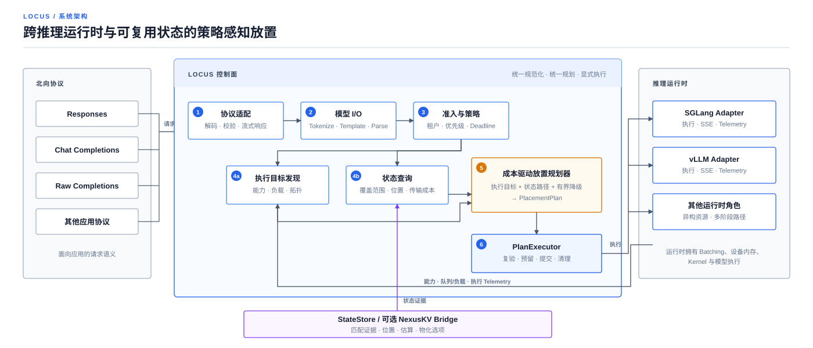

<h1 align="center">Locus</h1>

  <strong>跨推理引擎的策略感知放置控制面。</strong>

  每个请求只规范化一次，集群策略只应用一次。 
  在同一个决策中选择计算目标与可复用状态。

  <strong><a href="#两分钟跑通">快速开始</a></strong>
  &nbsp;&nbsp;&middot;&nbsp;&nbsp;
  <strong><a href="docs/design/architecture.md">架构设计</a></strong>
  &nbsp;&nbsp;&middot;&nbsp;&nbsp;
  <strong><a href="docs/operations/serving.md">部署与运维</a></strong>

  <a href="README.md">English</a> &nbsp;&middot;&nbsp; 简体中文

  
  
  
  

Locus 为由 SGLang 和 vLLM 组成的推理集群提供统一的 OpenAI 与 Anthropic
兼容推理入口。每个
请求只解析一次准确的模型语义，然后按凭证绑定的租户与流量策略完成准入，
根据能力筛选执行目标，并联合评估计算成本与兼容的可复用状态路径。

当放置决策需要理解模型能力、请求语义、租户策略、运行时负载与状态位置，而
不只是服务端点健康状态或请求数时，可以使用 Locus。推理引擎继续负责组批、
加速器内存、计算内核与模型执行；NexusKV 等可选状态系统提供复用证据和物化
选项，但不决定最终执行目标。

## 两分钟跑通

仓库内置的测试 Fixture 可以跑通完整 HTTP 路径，背后使用确定性模拟引擎。
不需要 GPU、模型下载、托管 API 密钥或外部服务；需要 Rust 1.85 或更高版本：

~~~bash
git clone https://github.com/imReese/Locus.git
cd Locus
cargo run -p locus-server --example sdk_fixture
~~~

在另一个终端发送 OpenAI Responses 请求：

~~~bash
curl http://127.0.0.1:18080/v1/responses \
  -H 'Authorization: Bearer locus-test-key' \
  -H 'Content-Type: application/json' \
  -d '{"model":"locus-test","input":"respond with JSON"}'
~~~

成功后会返回一个已完成的 OpenAI Responses 对象。确定性测试响应包含：

~~~json
{
  "model": "locus-test",
  "status": "completed",
  "output": [{"content": [{"text": "{\"answer\":\"ok\"}", "type": "output_text"}]}]
}
~~~

也可以通过固定版本的 OpenAI 官方 Python SDK 检查 Responses、Chat
Completions、原始 Completions、JSON/SSE、结构化输出、错误格式、鉴权与取消：

~~~bash
python -m pip install -r scripts/openai-sdk-e2e-requirements.txt
python scripts/openai_sdk_e2e.py --fixture-counts
~~~

这组快速开始能证明本地协议与编排路径，不能证明真实模型已经运行。

## 跟随一次请求

  

Locus 的 Planner 能使用普通 HTTP 路由层看不到的事实：

- 别名背后的精确 Tokenizer、Template、Parser 与模型版本；
- 执行目标是否支持请求所需的输出与执行语义；
- 租户额度、优先级、截止时间、取消与排空状态；
- 排队、Prefill、Decode、拓扑和策略成本；
- 兼容可复用状态的可执行范围、位置与物化成本。

规划与副作用保持分离。Planner 返回 <code>PlacementPlan</code>；
<code>PlanExecutor</code> 重新验证计划、预留目标、协调可选状态导入、提交
执行、应用有界降级并完成清理。

## Locus 在系统中的位置

这些组件解决的是不同层次的问题：

| 组件 | 决定什么 | 刻意留给其他层的职责 |
| --- | --- | --- |
| 通用 L7 代理 | 哪个上游服务接收 HTTP 请求 | 模型语义、运行时能力、可复用状态、引擎内执行 |
| 推理引擎调度器 | 单个运行时内部如何组批与执行 | 集群级租户策略与跨运行时放置 |
| 状态/缓存系统 | 哪些状态可复用、如何物化 | 最终请求放置与运行时本地消费 |
| **Locus** | 哪个合格目标与状态路径服务规范化请求 | 组批、设备分配、计算内核与物理数据面 |

当路由依赖推理语义，而不只是服务端点健康状态或请求数时，Locus 才有
意义。它不替代以上任何一层。

## 当前可用能力

> [!IMPORTANT]
> Locus 处于 pre-1.0 阶段。仓库包含可部署的控制面切片、确定性 CI 和真实的
> 本地 SDK 传输路径。真实 GPU 执行、原生引擎状态导入与物理状态传输需要
> 独立部署验证，不能由 CI 绿灯推导得出。

| 接口面 | 当前可用 | 尚需部署验证 |
| --- | --- | --- |
| API 与模型语义 | OpenAI Responses/Chat/Completions/模型列表、Anthropic Messages、JSON/SSE、工具调用、结构化输出、版本化 `ModelProfile` 与协议原生错误 | 更多模型方言、多模态输入和完整供应商参数对齐 |
| 流量与放置 | 凭证绑定租户、加权准入、截止时间、取消、能力过滤、可解释计划、有界重规划与 `shadow` 模式校准 | 真实负载下的公平性与放置准确性 |
| 引擎适配器 | SGLang 与 vLLM Completion、SSE 和 Prometheus 遥测适配器 | 针对已配置真实运行时与模型的重复验证 |
| 可复用状态 | 通用 <code>StateStore</code>、状态感知成本计算与版本化 NexusKV Bridge | 原生引擎导入与物理状态传输 |
| 运维 | 有界 HTTP/1.1+h2c、健康与就绪检查、Prometheus 指标、请求 ID、结构化追踪、过载拒绝、有界排空与优雅退出 | 生产环境长时间稳定性、TLS 边缘拓扑与容错行为 |

## 运行配置化服务

[<code>examples/locus-server.json</code>](examples/locus-server.json) 展示模型
配置、租户策略、运行时发现、有界遥测、`shadow` 模式放置与优雅排空。部署前
必须将其中的制品版本、路径、凭证和服务端点占位值替换为真实环境事实：

~~~bash
LOCUS_PREMIUM_API_KEY=replace-me \
LOCUS_BATCH_API_KEY=replace-me \
cargo run -p locus-server -- examples/locus-server.json
~~~

服务暴露 <code>/healthz</code>、<code>/readyz</code>、
<code>/metrics</code>、<code>/v1/models</code>、
<code>/v1/responses</code>、<code>/v1/chat/completions</code>、
<code>/v1/completions</code> 与 Anthropic <code>/v1/messages</code>。新部署应先在 <code>shadow</code> 模式完成放置
校准；进入 <code>active</code> 模式需要持久化的合格证据和操作员明确确认。

## 证据与验证

GitHub CI 覆盖静态与确定性检查、官方 OpenAI/Anthropic SDK 的本地 HTTP 路径，以及
版本化的跨进程状态协议。真实推理运行时、多运行时流量、原生状态导入、物理
传输与硬件行为仍属于显式可选或部署专属门禁。具体测试工具、观察项与验收
标准见 [Serving 验证与证据等级](docs/validation/serving.md)。

## 延伸阅读

| 目标 | 文档 |
| --- | --- |
| 理解职责与系统边界 | [架构](docs/design/architecture.md) |
| 实现引擎集成 | [Canonical Engine Protocol](docs/design/canonical-engine-protocol.md) · [Engine Adapter Contract](docs/design/engine-adapter-contract.md) |
| 添加模型语义或 API Dialect | [Model I/O](docs/design/model-io.md) · [OpenAI-compatible API](docs/design/openai-api.md) · [Anthropic-compatible API](docs/design/anthropic-api.md) |
| 跟踪计算与可复用状态规划 | [State-aware Scheduling](docs/design/state-aware-scheduling.md) · [NexusKV Bridge](docs/design/nexuskv-bridge.md) |
| 配置和运行 Server | [Serving 与配置](docs/operations/serving.md) |

Workspace 按请求路径组织：基础 Crate（core、model-io、parser）、引擎/状态
接口、Planner/Runtime 控制面、边缘适配器与 locus-server 应用。Package 名称
和职责见 [Crate Map](crates/README.md)。

## 开发

运行与 GitHub CI 相同的仓库门禁：

~~~bash
bash scripts/ci.sh
~~~

它检查格式、Workspace 严格 Clippy、启用所有 Feature 的测试、警告即错误的
Rustdoc、Python 语法与流量测试工具单元测试。Rust API 与公开 Wire Format
仍处于 pre-1.0。

## 参与贡献

欢迎提交 Bug 报告和范围明确的改动。发起 Pull Request 前请阅读
[贡献指南](CONTRIBUTING.md)；较大的协议或架构改动应先创建 GitHub Issue。

## 许可证

Locus 采用 [Apache License 2.0](LICENSE) 许可证。
